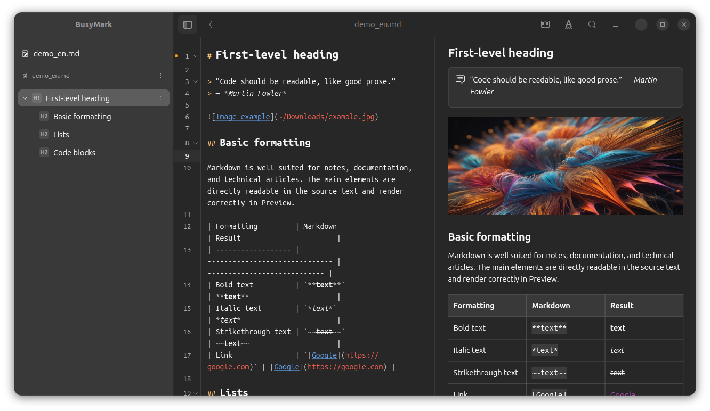
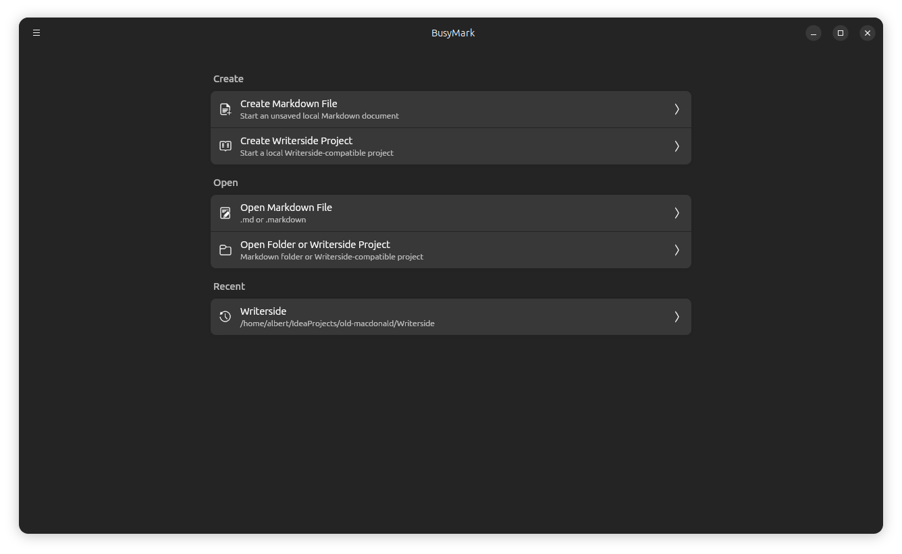
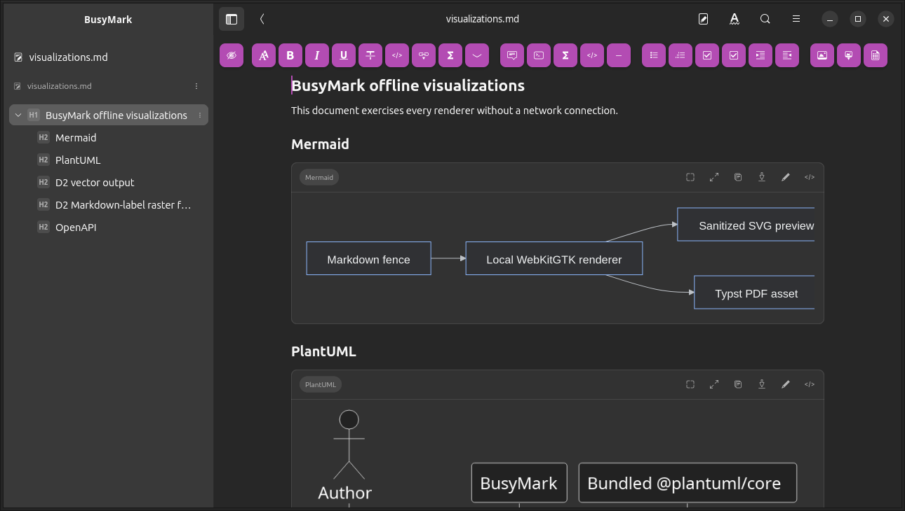
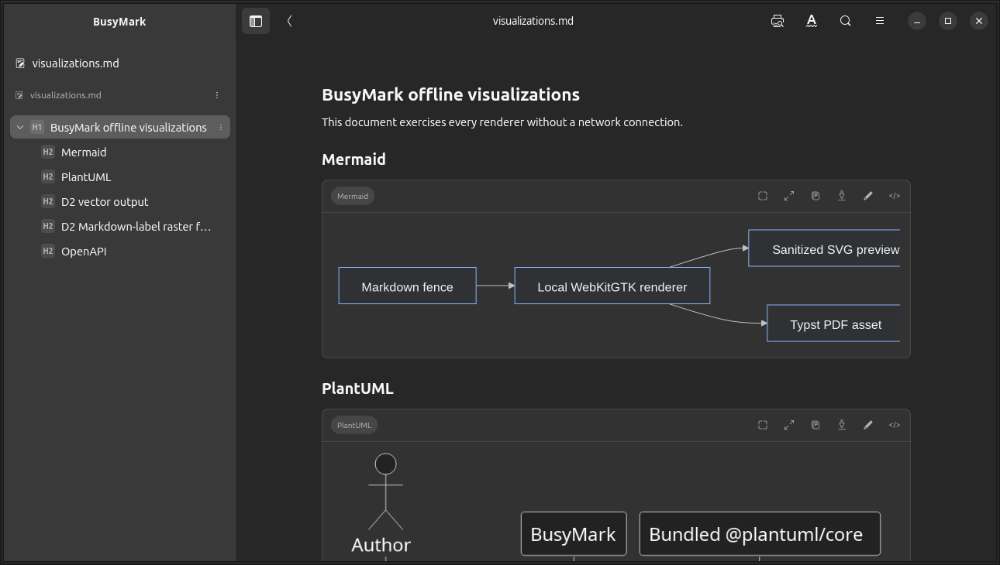
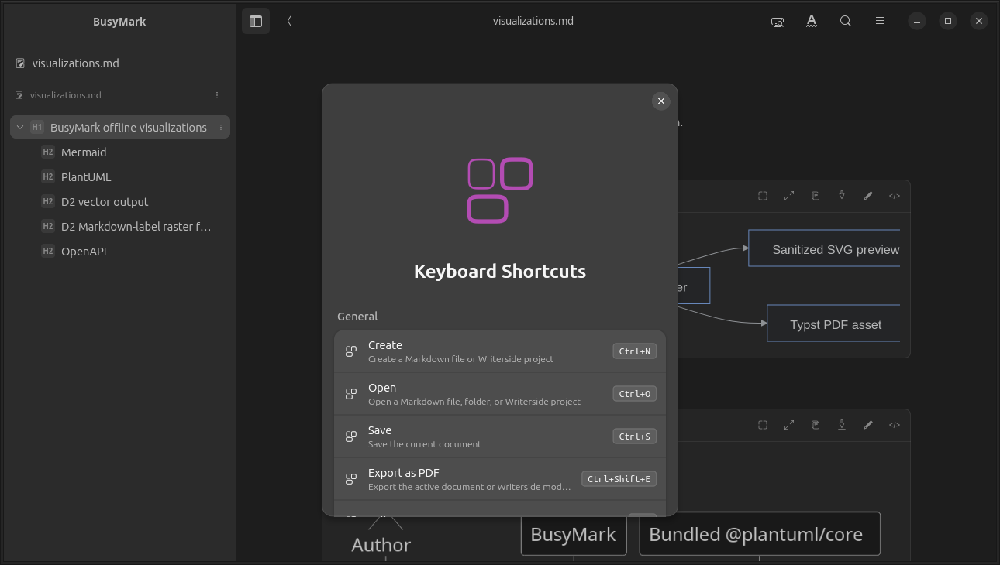

# BusyMark

BusyMark is a Markdown editor for Linux with support for Writerside-compatible documentation 
projects.

[](https://snapcraft.io/busymark)

[](https://snapcraft.io/busymark)

<p align="center">
  
</p>

<p align="center">
  <sub>Split view with a Writerside project tree, Markdown editor, and rendered preview.</sub>
</p>

## Features

- Open individual Markdown files.
- Open Markdown documentation folders.
- Open Writerside-compatible project folders.
- Create Writerside-compatible starter projects.
- Create Writerside Markdown and XML topics from the TOC.
- Create, select, import, edit, and reuse Writerside instances and TOC libraries.
- Edit and save local files.
- Read rendered Markdown without editing it.
- Render Mermaid, PlantUML, D2, and fenced OpenAPI content locally and offline.
- Typeset inline and display mathematics locally and offline with bundled
  MathJax, including Writerside math forms and vector PDF output.
- Edit Markdown with free-form AI instructions, an explicit change target, and
  explicitly selected context through Ollama, OpenAI, or Gemini, with
  diff-before-apply review.
- Export Markdown documents as accessible, tagged PDF files.
- Navigate project files, table of contents, and document outline.
- Run basic diagnostics.
- Reopen recent workspaces.
- Use native Linux desktop chrome with a GTK headerbar.

## Screenshots

<table>
  <tr>
    <td width="50%">
      
      <br>
      <sub><b>Welcome screen</b> for creating or opening Markdown and Writerside workspaces.</sub>
    </td>
    <td width="50%">
      
      <br>
      <sub><b>Editor view</b> with formatting tools and document outline navigation.</sub>
    </td>
  </tr>
  <tr>
    <td width="50%">
      
      <br>
      <sub><b>Reading view</b> for rendered Markdown documentation.</sub>
    </td>
    <td width="50%">
      
      <br>
      <sub><b>Keyboard shortcuts</b> shown in the built-in shortcut reference.</sub>
    </td>
  </tr>
</table>

## Supported platforms

BusyMark is currently developed and tested for Linux desktop, especially GNOME
and Ubuntu-style GTK environments.

## Supported files and projects

BusyMark can open Markdown files such as `.md` and `.markdown`.

BusyMark opens Writerside help modules whose root contains `writerside.cfg` or
the equivalent older `project.ihp` file. Writerside support includes documented
configuration locations for topics, images, variables, categories, instances,
snippets, build configuration, API specifications, instance groups, and selected
settings metadata. Topic support includes Markdown topics, XML `.topic` files,
TOC registration, instance-specific topic titles, and custom web file names.
Instance support includes local selection and icon colors, version/web-path and
build settings, Markdown import, status, ID refactoring, instance groups,
conditional and reusable TOC sections, and cross-instance topic references.
See [Writerside instances](docs/writerside-instances.md) for behavior, safety
rules, an openable example, and the authoritative JetBrains references.

Folder workspaces show all files and directories, including hidden project
files such as `.gitignore`. Unsupported and binary files remain visible but are
disabled in the text editor. Version-control metadata directories such as
`.git` are excluded, and traversal remains bounded for safety.

## PDF export

Use **Main menu → Export as PDF** or <kbd>Ctrl</kbd>+<kbd>Shift</kbd>+<kbd>E</kbd>
to export either the active Markdown document or the opened Writerside module.
Markdown export uses the current editor contents, including unsaved changes,
and offers A4 or Letter paper, portrait or landscape orientation, three margin
sizes, and optional page numbers.

Markdown PDF generation is local and offline. BusyMark bundles the pinned Typst
compiler; users do not install or configure a separate program. Local PNG,
JPEG, GIF, and safe SVG images are included. Remote images are deliberately not
downloaded during export and are represented by their alternative text.

Inline and display equations use the same bundled MathJax semantics in preview
and PDF export. Safe generated equations remain self-contained vector SVG, with
inline baseline metrics carried into Typst. See [mathematical expressions](docs/math.md)
for supported Markdown and Writerside forms, the scientific TeX package profile,
editing behavior, and offline security boundaries.

Mermaid and PlantUML fences are exported as vector diagrams. D2 uses normalized
SVG where possible and a local high-resolution raster fallback for browser-only
labels. OpenAPI fences become static, selectable API reference content. Failed
visualizations fall back to their original source and produce an export warning.

See [offline visualizations](docs/visualizations.md) for supported fences,
security policy, pinned engines, architecture, and verification. Working
examples are in [demo/visualizations.md](demo/visualizations.md),
[demo/openapi-local-reference.md](demo/openapi-local-reference.md), and
[demo/plantuml-conformance.md](demo/plantuml-conformance.md).

Writerside PDF export builds one selected output instance with JetBrains'
official, versioned Writerside builder image. It supports generated settings or
an existing project `PDF.xml`, including orientation, keymap, cover page,
header, footer, and table-of-contents title. Docker is required, the large image
is downloaded only after confirmation, project sources stay read-only, and
builder network access is disabled unless explicitly enabled. See
[Writerside PDF export](docs/writerside-pdf-export.md) for setup, customization,
security boundaries, Snap limitations, and the authoritative JetBrains
references. An exportable configuration is included in
[demo/writerside-instances](demo/writerside-instances).

## AI editing

BusyMark's optional AI editing is disabled by default and supports loopback
Ollama, OpenAI, and Google Gemini. In Source and Editor views, select text and
choose **Refine with AI** from its context menu, or press **Ctrl+G**. The user
then writes the instruction and independently chooses what may change and what
document context may be shared. Staged-diff commit-message drafting is
available separately in Git Changes. BusyMark discloses the exact context,
streams into a temporary proposal, reparses and validates the complete
candidate Markdown document, shows a unified diff, and never applies a proposal
without confirmation. Cloud
keys are stored in the operating-system credential service and cloud use
requires explicit consent; provider routing never crosses provider boundaries.

See [AI editing](docs/local-ai.md) for configuration, privacy and security
boundaries, model routing, release qualification, and authoritative protocol
references. An interactive exercise is available in
[demo/ai-editing.md](demo/ai-editing.md).

## Run From Source

1. [Install Flutter](https://docs.flutter.dev/install)

2. Run the application:

```bash
flutter doctor
flutter pub get
flutter run -d linux
```

Open a file or folder from the command line:

```bash
flutter run -d linux -- /path/to/README.md
flutter run -d linux -- /path/to/docs
```

## Feedback API

The **Main menu → Report an issue** form
submits JSON to `https://busystack.org/api/feedback`. BusyMark sends no private
credentials or other API secrets; storage is handled by BusyStack.org.

Every request contains a newly generated submission UUID, `app: "busymark"`,
the application version and build number read from the current package's
generated build metadata (including Flutter build overrides),
`platform: "linux"`, the selected category, subject, detailed message, and the
optional reply email. The optional `technicalDetails` object is included after
user explicitly selects the checkbox. It contains exactly the Linux
operating-system version and the BusyMark application locale; logs, files,
document content, paths, account data, tokens, screenshots, and attachments are
never added.

```json
{
  "submissionId": "b3f44f5f-dae4-4c6e-bf56-657f35f3450a",
  "app": "busymark",
  "appVersion": "0.2.2",
  "buildNumber": "0",
  "platform": "linux",
  "category": "problem",
  "subject": "Example subject",
  "message": "Detailed feedback message",
  "replyEmail": null,
  "technicalDetails": {
    "osVersion": "Linux version string",
    "locale": "en"
  }
}
```

The endpoint returns HTTP 201 and `{"id":"<server reference ID>"}` after it
accepts a report. Validation failures, connection failures, timeouts, rate
limits, and server failures are shown without clearing the entered form.

For local development, override only the endpoint at build time. For example,
when the BusyStack.org backend is listening on port 8090:

```bash
flutter run -d linux \
  --dart-define=BUSYSTACK_FEEDBACK_ENDPOINT=http://127.0.0.1:8090/api/feedback
```

Production builds use the HTTPS endpoint by default. No credential belongs in
the Dart define or in the desktop application.

## Test

```bash
flutter analyze
flutter test
```

## Localization

BusyMark has ARB localization files for:

- Arabic (ar)
- English (en)
- Estonian (et)
- French (fr)
- German (de)
- Hindi (hi)
- Italian (it)
- Norwegian Bokmål (nb)
- Persian (fa)
- Polish (pl)
- Portuguese (pt)
- Russian (ru)
- Spanish (es)
- Ukrainian (uk)

English in `lib/l10n/app_en.arb` is the source of truth for app strings.

Target ARB files are audited for catalog parity, placeholders, plurals, and
terminology.

When changing user-facing text, update `app_en.arb`, keep every target ARB in
sync, then run:

```bash
flutter gen-l10n
flutter analyze
flutter test
```

Linux `.desktop` and AppStream metadata are localized in the repository. Snap
Store listing translations are managed outside `snap/snapcraft.yaml`.

## Build Linux Locally

Source builds require the libhandy and WebKitGTK 4.1 development headers,
`curl`, `xz-utils`, and Node.js 22 or newer with npm. Node.js is used only to
assemble the checksum-pinned web bundle. Packaged users receive every runtime
component with BusyMark and do not install development packages, Node.js, Java,
or Chromium.

```bash
sudo apt-get install curl libhandy-1-dev xz-utils libwebkit2gtk-4.1-dev
# Install Node.js 22 or newer from https://nodejs.org/en/download
node --version
npm --version
flutter build linux
```

The Linux build downloads the matching x86_64 or ARM64 Typst 0.15.1 binary, the
Linux amd64 D2 0.7.1 release, and exact JavaScript packages, then verifies the
pinned artifacts before bundling them. D2 visualization is currently packaged
only for amd64. To reuse already downloaded official Typst and D2 archives,
point the build at them:

```bash
BUSYMARK_TYPST_ARCHIVE=/path/to/typst-x86_64-unknown-linux-musl.tar.xz \
BUSYMARK_D2_ARCHIVE=/path/to/d2-v0.7.1-linux-amd64.tar.gz \
  flutter build linux
```

A clean source build still assembles the checksum-pinned JavaScript packages.
The resulting BusyMark application is self-contained and performs no runtime
downloads for visualization.

The Linux desktop file uses the application id `io.busystack.busymark` and
installs the app icon from `assets/branding/busymark_logo.svg`.

## Contributing

Issues and small focused pull requests are welcome. Please keep changes aligned
with the current beta scope: local editing, Linux desktop quality, safe file
handling, and clear user-facing behavior.

## License

Apache-2.0. See [LICENSE](LICENSE). Bundled Typst and D2 licenses and notices are
installed under `share/licenses`; visualization JavaScript licenses, package
metadata, the exact lock file, and consolidated notices are installed with the
offline web bundle.
