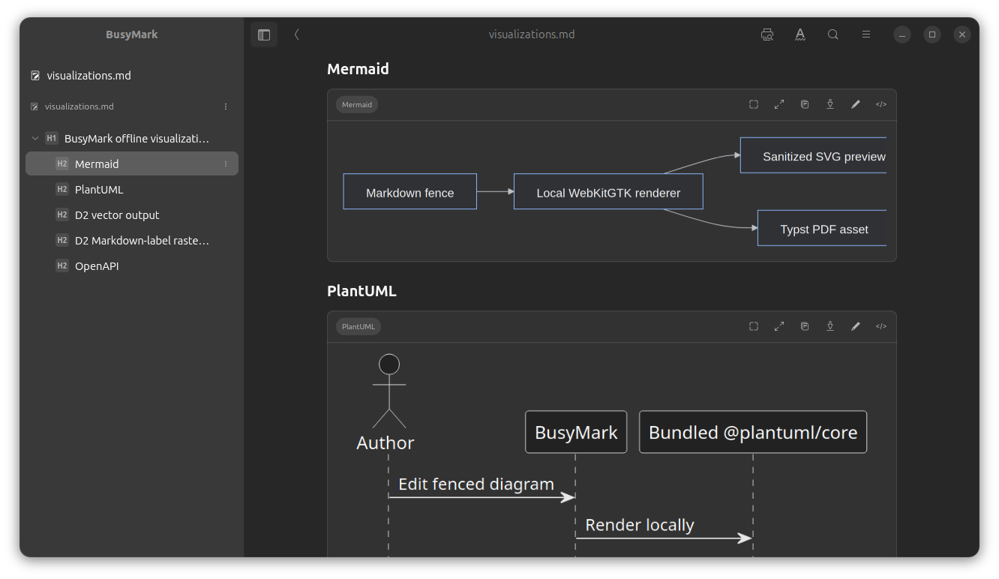
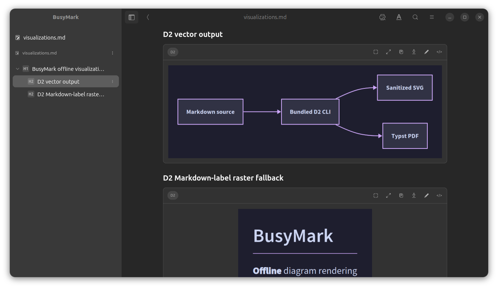
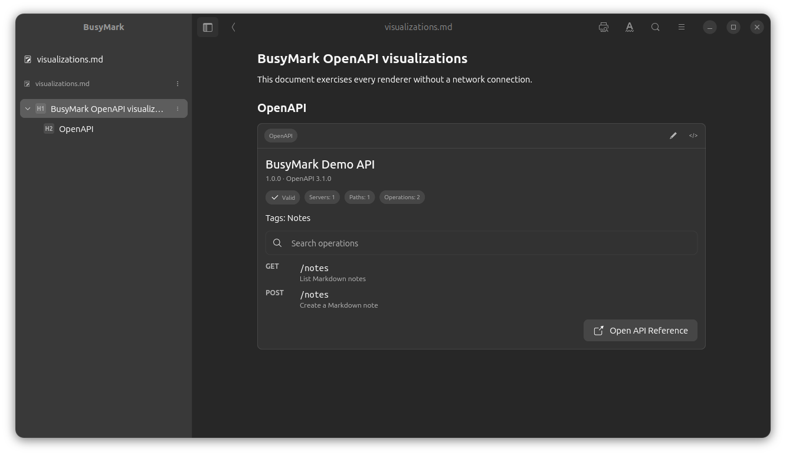
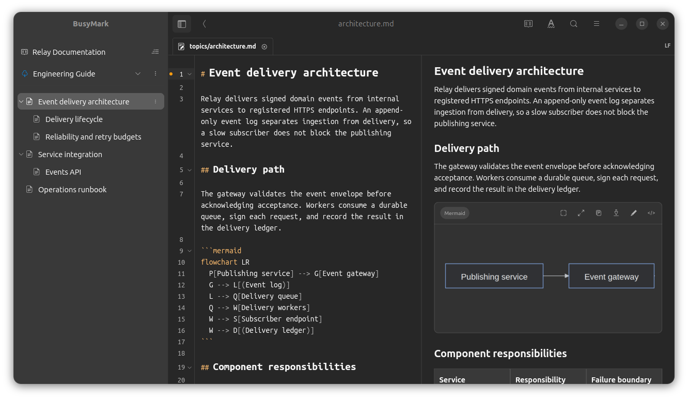

# BusyMark

Markdown and Writerside editor for Linux.

[](https://snapcraft.io/busymark)

[](https://snapcraft.io/busymark)

<p align="center">
  
</p>

## Features

* **Markdown editing** — Source, Editor, Reading, and Split views with formatting tools, syntax highlighting, code folding, tables, images, links, code blocks, callouts, collapsible content, and document diagnostics.
* **Writerside projects** — Open and create Writerside-compatible projects; edit Markdown and XML topics; manage instances, tables of contents, reusable TOC libraries, and project structure.
* **Project navigation and search** — Files, TOC, and Outline views, tabbed documents, command palette, keyboard shortcuts, document search and replace, reviewed workspace-wide replacement, and Markdown TOC generation.
* **Technical documentation** — Local rendering of Mermaid, PlantUML, D2, fenced OpenAPI specifications, and MathJax mathematical expressions.
* **PDF and HTML publishing** — Export Markdown documents and Writerside instances to configurable PDF or portable offline HTML, with controls for layout, typography, tables of contents, heading numbering, and HTML styling.
* **Git integration** — Review changes and diffs, stage and unstage files, commit, create and switch branches, fetch, pull, push, inspect file and project history, compare historical versions, and restore earlier file versions.
* **Clipboard and Local History** — Reuse source, rich-text, and image fragments during the current session; compare and restore persistent on-device document revisions independently of Git.
* **AI-assisted editing** — Optional Ollama, OpenAI, and Gemini integration with explicit edit scope and shared context, proposal review before changes are applied, and AI-assisted Git commit-message drafting.
* **Workspace reliability** — Detect files changed outside BusyMark, recover unsaved documents, restore previous workspace sessions, manage remote-image permissions, and protect Git operations behind workspace trust.

## Screenshots

<table>
  <tr>
    <td width="50%">
      
      <br>
      <sub><b>Split view</b> with Markdown source and rendered document.</sub>
    </td>
    <td width="50%">
      
      <br>
      <sub><b>Editor view</b> with formatting tools and document navigation.</sub>
    </td>
  </tr>
  <tr>
    <td width="50%">
      
      <br>
      <sub><b>Reading view</b> for rendered documentation.</sub>
    </td>
    <td width="50%">
      
      <br>
      <sub><b>Keyboard shortcuts</b> reference.</sub>
    </td>
  </tr>
  <tr>
    <td width="50%">
      
      <br>
      <sub><b>Mermaid and PlantUML</b> diagrams rendered directly in the document.</sub>
    </td>
    <td width="50%">
      
      <br>
      <sub><b>D2</b> diagram rendering.</sub>
    </td>
  </tr>
  <tr>
    <td width="50%">
      
      <br>
      <sub><b>OpenAPI</b> documentation rendering.</sub>
    </td>
    <td width="50%">
      
      <br>
      <sub><b>Writerside</b> project and table-of-contents editing.</sub>
    </td>
  </tr>
</table>

## Markdown and Writerside

BusyMark opens Markdown files using `.md` and `.markdown` extensions and can work with ordinary documentation folders.

Writerside-compatible projects are recognized through `writerside.cfg` and the older `project.ihp` format. BusyMark supports Markdown and XML topics, Writerside instances, tables of contents, reusable content, project configuration, and other commonly used Writerside documentation features.

More information:

* [Writerside instances](docs/writerside-instances.md)
* [Writerside videos](docs/videos.md)
* [Admonitions](docs/admonitions.md)
* [Collapsible elements](docs/collapsible-elements.md)

## Diagrams and mathematics

BusyMark renders Mermaid, PlantUML, D2, and fenced OpenAPI content locally. Mathematical expressions are rendered with the bundled MathJax environment.

See:

* [Offline visualizations](docs/visualizations.md)
* [Mathematical expressions](docs/math.md)

## Export

BusyMark can export the current Markdown document or a Writerside instance to PDF and portable offline HTML.

PDF export supports configurable paper size, orientation, margins, typography, headers and footers, page numbering, table of contents, and heading numbering.

See:

* [PDF export settings](docs/pdf-export.md)
* [Writerside PDF export](docs/writerside-pdf-export.md)
* [HTML export](docs/html-export.md)

## AI editing

AI-assisted editing is optional and disabled by default.

BusyMark supports Ollama, OpenAI, and Google Gemini. Proposed edits are presented for review before changes are applied.

See [AI editing](docs/local-ai.md) for configuration, privacy, provider behavior, and security information.

## History and recovery

See [Clipboard History and Local History](docs/history.md) for collection scope,
limits, retention, restoration, exclusions, and how these tools differ from
undo, crash recovery, and Git. Implementation and verification details are in
[the history architecture note](docs/history-architecture.md).

## Installation

Install BusyMark from the Snap Store:

```bash
sudo snap install busymark --beta
```

The Snap uses strict confinement. See [Snap confinement notes](docs/snap-confinement.md) for details about filesystem and Git integration.

## Run from source

BusyMark currently uses Flutter 3.47.2.

Install the required Linux development packages:

```bash
sudo apt-get install \
  curl \
  libhandy-1-dev \
  xz-utils \
  libwebkit2gtk-4.1-dev \
  fonts-noto-core \
  fonts-noto-mono
```

Node.js 22 or newer with npm is also required when building the bundled web components.

Prepare and run the application:

```bash
flutter doctor
flutter pub get
flutter run -d linux
```

A Markdown file or documentation folder can be opened directly from the command line:

```bash
flutter run -d linux
```

## Build

Build the Linux desktop application with:

```bash
flutter build linux
```

The build assembles the runtime components required by BusyMark. Packaged users do not need separate Typst, Java, Node.js, or Chromium installations.

## Test

```bash
flutter analyze
flutter test
```

## Contributing

Issues and focused pull requests are welcome.

Changes should remain consistent with BusyMark's current scope as a desktop Markdown and Writerside documentation editor.

## License

BusyMark is licensed under the Apache License 2.0. See [LICENSE](LICENSE).

Licenses and notices for bundled third-party components are distributed with the application.
