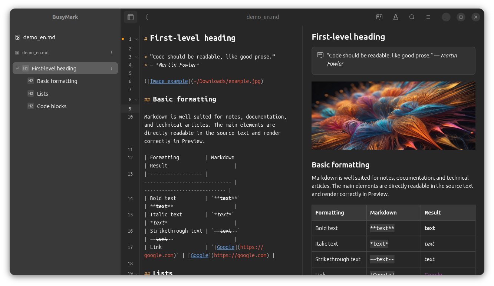
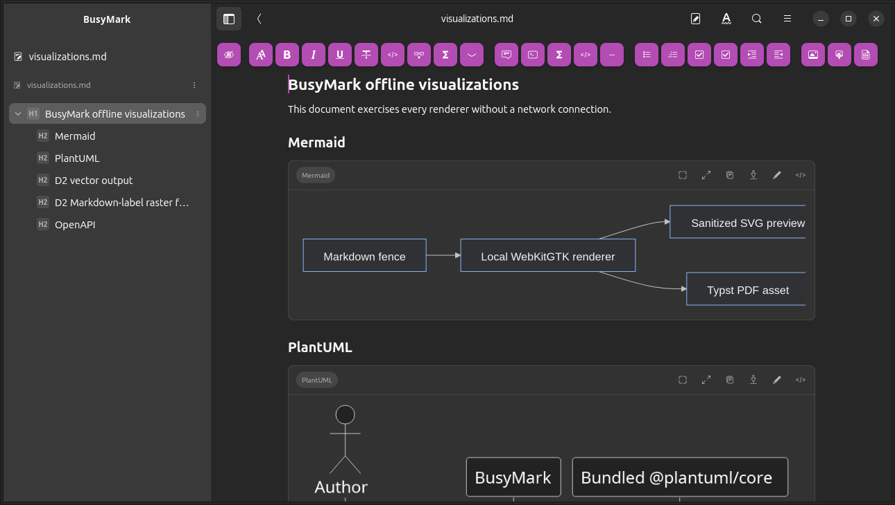
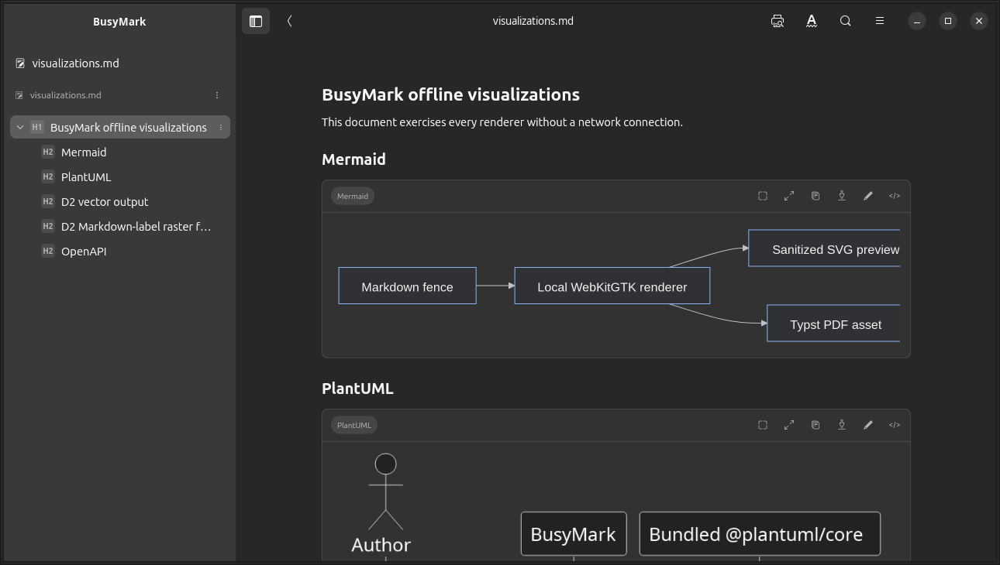
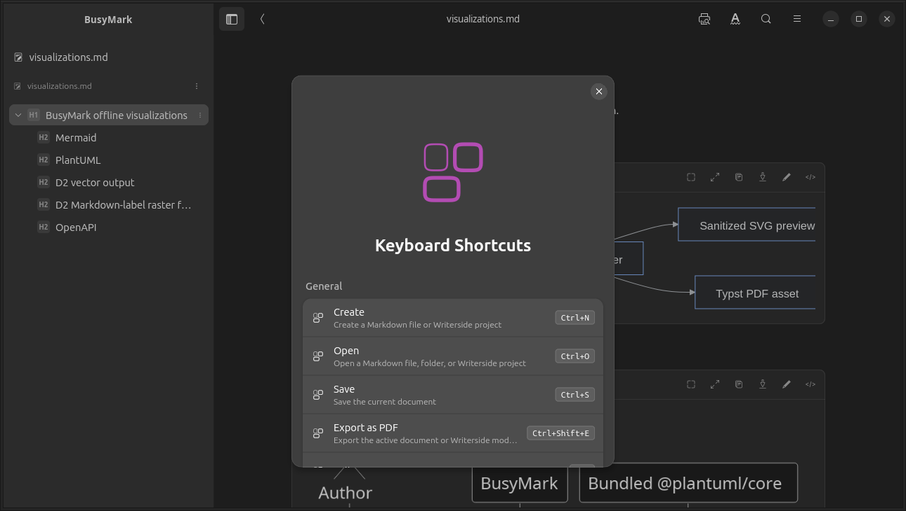
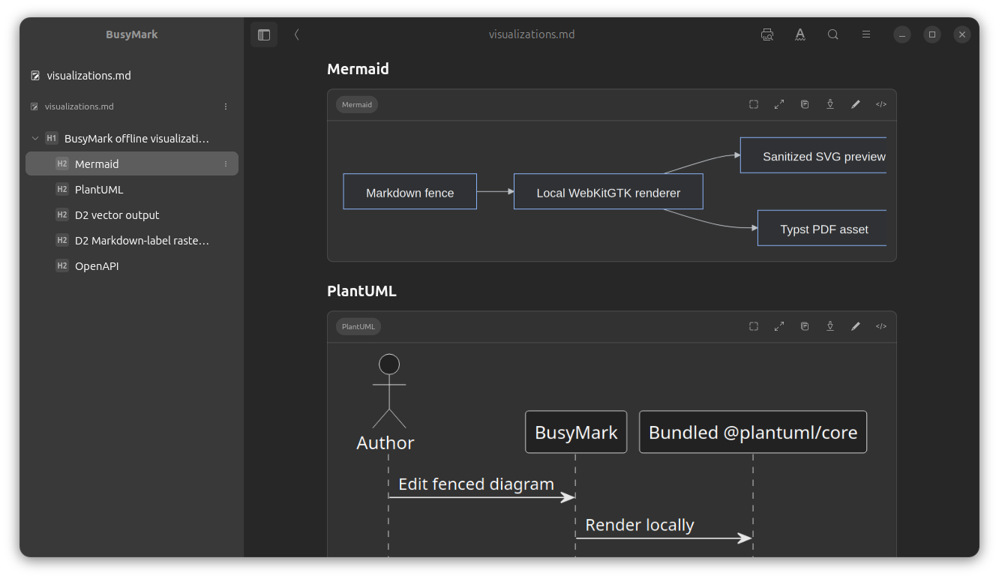
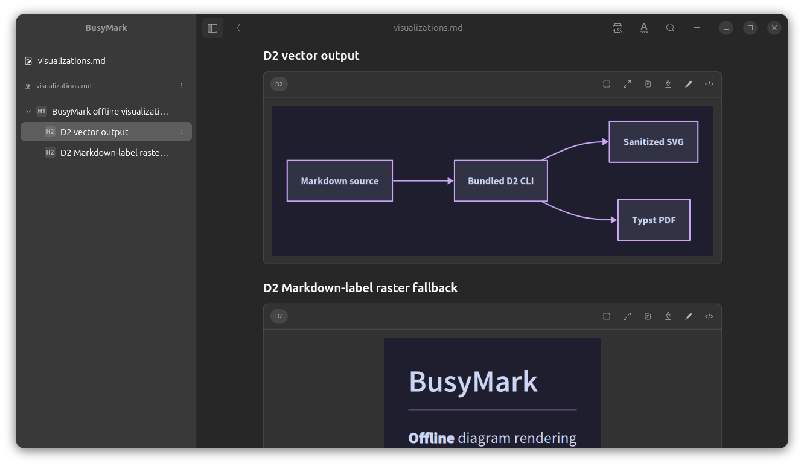
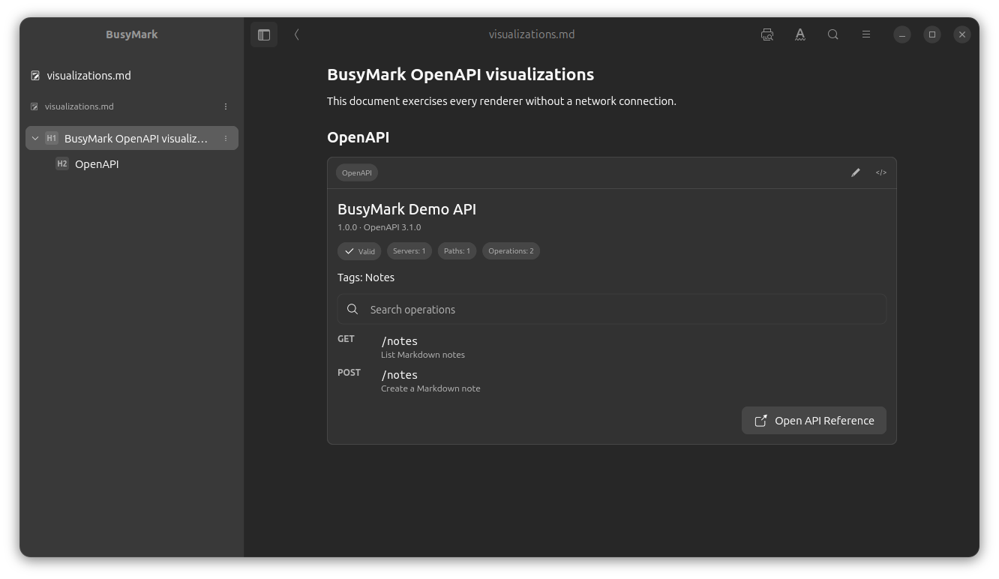
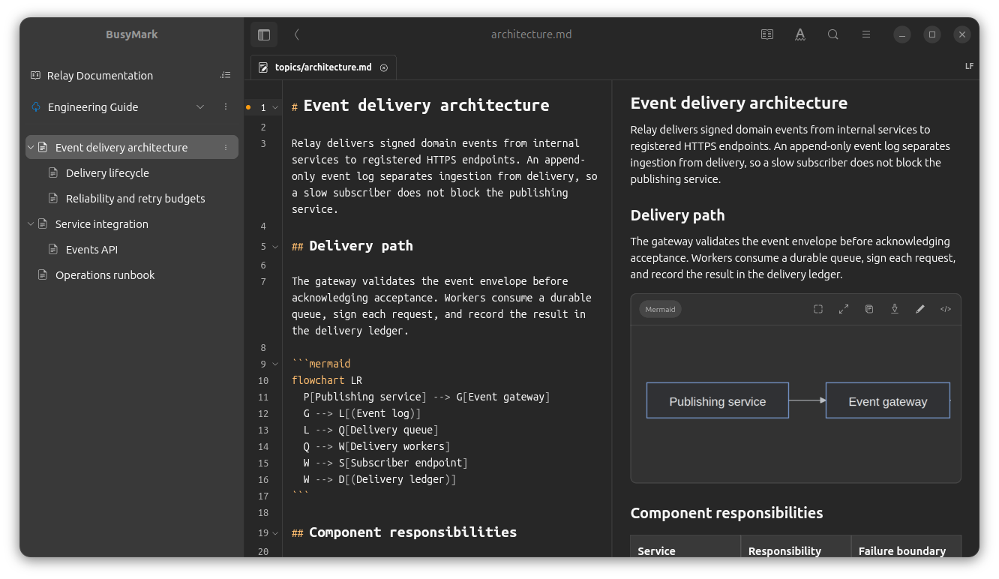

# BusyMark

Markdown, Writerside, and Nextcloud Notes editor for Linux.

[](https://snapcraft.io/busymark)

<a href="https://snapcraft.io/busymark">
  
</a>
<p align="center">
  
</p>

## Features

* **Markdown editing** — Source, Editor, Reading, and Split views with formatting tools, syntax highlighting, code folding, tables, images, links, code blocks, callouts, collapsible content, and document diagnostics.
* **Writerside projects** — Open and create Writerside-compatible projects; edit Markdown and XML topics; manage instances, tables of contents, reusable TOC libraries, and project structure.
* **Nextcloud Notes** — Connect to a Nextcloud server, create and edit notes offline, synchronize changes, search and filter notes, manage categories and favorites, and work with attachments.
* **Navigation and search** — Files, Topics, and Outline views, tabbed documents, command palette, keyboard shortcuts, document search and replace, reviewed replacement across local workspaces, and Markdown TOC generation.
* **Technical documentation** — Local rendering of Mermaid, PlantUML, D2, fenced OpenAPI specifications, and MathJax mathematical expressions.
* **PDF and HTML publishing** — Export Markdown documents and Writerside instances to configurable PDF or portable offline HTML, with controls for layout, typography, tables of contents, heading numbering, and HTML styling.
* **Git integration for local workspaces** — Review changes and diffs, stage and unstage files, commit, create and switch branches, fetch, pull, push, inspect file and project history, compare historical versions, and restore earlier file versions.
* **Clipboard and Local History** — Reuse source, rich-text, and image fragments during the current session; compare and restore persistent on-device document revisions independently of Git.
* **AI-assisted editing** — Optional Ollama, OpenAI, and Gemini integration with explicit edit scope and shared context, proposal review before changes are applied, and AI-assisted Git commit-message drafting.
* **Workspace reliability** — Detect files changed outside BusyMark, recover unsaved documents, restore previous workspace sessions, manage remote-image permissions, and protect Git operations behind workspace trust.

## Installation

Install BusyMark from the Snap Store:

```bash
sudo snap install busymark --beta
```

The Snap uses strict confinement. See [Snap confinement](docs/snap-confinement.md)
for filesystem and Git-integration details.

## Run from source

BusyMark currently uses Flutter 3.47.5. Install the Linux packages required by
Flutter and BusyMark's CMake configuration:

```bash
sudo apt-get install -y \
  clang \
  cmake \
  curl \
  fonts-noto-core \
  fonts-noto-mono \
  libgtk-3-dev \
  libhandy-1-dev \
  libsecret-1-dev \
  libwebkit2gtk-4.1-dev \
  ninja-build \
  pkg-config \
  xz-utils
```

Node.js 22 or newer with npm is also required to build the bundled web
components.

Prepare and run the application:

```bash
flutter doctor
flutter pub get
flutter run -d linux
```

Pass a Markdown file or documentation directory after `--` to open it at
startup:

```bash
flutter run -d linux -- /absolute/path/to/document.md
flutter run -d linux -- /absolute/path/to/documentation
```

Build and run the standard checks with:

```bash
flutter build linux
flutter analyze
flutter test
```

The build assembles BusyMark's runtime components. Packaged users do not need
separate Typst, Java, Node.js, or Chromium installations.

The CI workflow installs additional packages for headless X11/Wayland, browser,
PDF, and sandbox verification. Those packages are not required for an ordinary
local build; see [the Linux workflow](.github/workflows/flutter-linux.yml) when
reproducing release verification.

## Snap release and security builds

Release, security-refresh, and packaging-change artifacts must be built from
the current `snap/snapcraft.yaml` in a clean Ubuntu 24.04 amd64 Snapcraft build
environment. The authoritative build sequence is:

```bash
snapcraft --version
snapcraft expand-extensions
snapcraft clean
snapcraft
sha256sum ./busymark_*.snap
```

Inspect and test the exact file emitted by the final `snapcraft` command. A
failed build must not fall back to an older `.snap`. The `snap` job in
[the Linux workflow](.github/workflows/flutter-linux.yml) follows this route,
installs that selected artifact, and runs the strict-confinement smoke checks.

`tools/build_install_snap_local.sh` is intentionally different: it replaces
the Flutter payload in an installed Snap scaffold for quick development and
may retain that scaffold's Ubuntu libraries and bundled tools. Even with
`--no-install`, its output is not a dependency refresh and must not be used for
a release, a security update, or validation of `stage-packages` changes.

## Screenshots

<table>
  <tr>
    <td width="50%">
      
      <br>
      <sub><b>Split view</b> with Markdown source and rendered document.</sub>
    </td>
    <td width="50%">
      
      <br>
      <sub><b>Editor view</b> with formatting tools and document navigation.</sub>
    </td>
  </tr>
  <tr>
    <td width="50%">
      
      <br>
      <sub><b>Reading view</b> for rendered documentation.</sub>
    </td>
    <td width="50%">
      
      <br>
      <sub><b>Keyboard shortcuts</b> reference.</sub>
    </td>
  </tr>
  <tr>
    <td width="50%">
      
      <br>
      <sub><b>Mermaid and PlantUML</b> diagrams rendered directly in the document.</sub>
    </td>
    <td width="50%">
      
      <br>
      <sub><b>D2</b> diagram rendering.</sub>
    </td>
  </tr>
  <tr>
    <td width="50%">
      
      <br>
      <sub><b>OpenAPI</b> documentation rendering.</sub>
    </td>
    <td width="50%">
      
      <br>
      <sub><b>Writerside</b> project and table-of-contents editing.</sub>
    </td>
  </tr>
</table>

## Documentation

The [documentation index](docs/README.md) lists user guides and the separate
developer notes.

## Markdown and Writerside

BusyMark opens Markdown files using `.md` and `.markdown` extensions and can work with ordinary documentation folders.

Writerside-compatible projects are recognized through `writerside.cfg` and the older `project.ihp` format. BusyMark supports Markdown and XML topics, Writerside instances, tables of contents, reusable content, project configuration, and other commonly used Writerside documentation features.

More information:

* [Writerside support and limitations](docs/writerside-support.md)
* [Writerside instances](docs/writerside-instances.md)
* [Writerside videos](docs/videos.md)
* [Admonitions](docs/admonitions.md)
* [Collapsible elements](docs/collapsible-elements.md)

## Nextcloud Notes

BusyMark can open a **Nextcloud Notes** workspace alongside its local Markdown and Writerside workflows. Notes stay associated with your Nextcloud account rather than a folder on your computer.

### Connect your account

1. Ensure the **Notes** app is enabled on your Nextcloud server.
2. On BusyMark’s welcome screen, choose **Nextcloud Notes**. You can also open **Settings → Nextcloud Notes**.
3. Enter the full **HTTPS** address of your Nextcloud server and click **Connect**.
4. Complete authorization in your default web browser. BusyMark verifies Notes compatibility and opens the note workspace.

Once connected, select **Nextcloud Notes** on the welcome screen to reopen the workspace. Use **Settings → Nextcloud Notes** to open it, reconnect, or disconnect the account. **One Nextcloud account can be connected at a time.**

### Work with notes

* **Create and edit:** Create notes from the Notes sidebar and edit them using the normal Markdown editor. Use each note’s menu to change its title, category, or favorite status, save a separate local copy, or delete the note.
* **Find and organize:** Use All notes, Favorites, Uncategorized, Recovery, or a category and its descendants. Sort by activity or title. Ctrl-click toggles selection, Shift-click selects a range, and Ctrl+A selects the current list; the selected-notes action reviews batch favorite/category changes and reports partial outcomes.
* **Quick Open and search:** Ctrl+P finds titles/categories, including unopened cached notes; Ctrl+Shift+P opens the command palette. Notes search combines terms with AND and supports quoted phrases, `title:` / `category:` restrictions, whole words, snippets, and navigation to the match. Unsaved open text is included without forcing a save.
* **Work offline:** Edits and new notes are saved locally before synchronization and survive restart. **Make available offline** retains a note or category/subtree's supported managed media. Its status lists available/missing bytes and offers deliberate retry/cancellation. Offline availability, freshness, and acknowledged synchronization are separate states; external dependencies remain identified.
* **Review conflicts:** If a note changes on the server while you have local edits, BusyMark preserves the competing versions for review instead of silently overwriting one. The comparison workflow supports choosing a version, merging changes, or recovering content as a separate note. Ambiguous note-creation results also require explicit review.
* **Use attachments:** Add files to notes, view supported images and media, and include managed resources when exporting Markdown or HTML. PDF export includes supported images but does not embed arbitrary file attachments. New uploads are limited to **100 MiB per file**.
* **Export and import:** Keep per-note **Save local copy**, PDF, and offline HTML exports, or export a category/subtree or account as ordinary Markdown with companion media and a versioned metadata manifest. Dirty buffers must save first; missing media is listed explicitly. Import Markdown files/folders or these snapshots through a review of categories, media, and collisions. Imports create distinct notes and resume successful local items after interruption.
* **Recover:** Recovery lists retained deleted notes and available Local History revisions, previews their content/media availability, and recovers as a new note. It uses local retention settings; Nextcloud server trash/history is unavailable.

See the [Notes workspace guide](docs/development/nextcloud-notes.md#everyday-notes-workspace) for search syntax, offline requirements, recovery, and the portable snapshot format.

### Requirements and limitations

* BusyMark requires a server advertising **Nextcloud Notes API 1.4 or later in API major version 1**. Notes 6.0.x and 6.1.x are supported baselines. **Deleting attachments** requires Notes 6.1.0 or newer.
* Connections require HTTPS and certificates trusted by the operating system. Authentication uses Nextcloud’s browser-based Login Flow; the resulting app password is stored in the Linux keyring (libsecret), not in the notes database.

## Search and replace

BusyMark supports active-document replacement and reviewed workspace-wide
replacement for local workspaces. Nextcloud Notes supports replacement within
individual notes, but not workspace-wide replacement. See [Search and replace](docs/search-and-replace.md) for search
options, scope, preview behavior, and stale-result handling.

## Diagrams and mathematics

BusyMark renders Mermaid, PlantUML, D2, and fenced OpenAPI content locally. Mathematical expressions are rendered with the bundled MathJax environment.

See:

* [Offline visualizations](docs/visualizations.md)
* [Mathematical expressions](docs/math.md)

## Export

BusyMark can export the current Markdown document (including a Nextcloud note) or a Writerside instance to PDF and portable offline HTML.

PDF export supports configurable paper size, orientation, margins, typography, headers and footers, page numbering, table of contents, and heading numbering.

See:

* [PDF export settings](docs/pdf-export.md)
* [Writerside PDF export](docs/writerside-pdf-export.md)
* [HTML export](docs/html-export.md)

## AI editing

AI-assisted editing is optional and disabled by default.

BusyMark supports Ollama, OpenAI, and Google Gemini. Proposed edits are presented for review before changes are applied.

See [AI editing](docs/local-ai.md) for configuration, privacy, provider behavior, and security information.

## History and recovery

See [Clipboard History and Local History](docs/history.md) for collection scope,
limits, retention, restoration, exclusions, and how these tools differ from
undo, crash recovery, and Git. Implementation and verification details are in
[the history implementation notes](docs/development/history.md).

## Contributing

Issues and focused pull requests are welcome.

Changes should remain consistent with BusyMark's scope as a Linux desktop editor for Markdown, Writerside documentation, and Nextcloud Notes.

## License

BusyMark is licensed under the Apache License 2.0. See [LICENSE](LICENSE).

Licenses and notices for bundled third-party components are distributed with the application.
