# PlantUML browser-build conformance corpus

These diagrams cover the PlantUML families supported for BusyMark's first release.

## Sequence

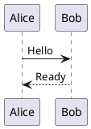

## Class

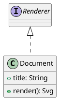

## Component

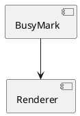

## Deployment

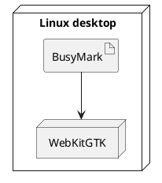

## State

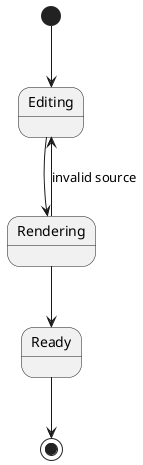

## Activity

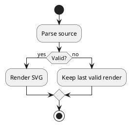

## Use case

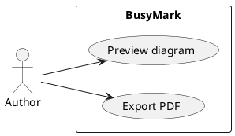

## Entity relationship

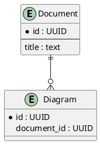

## Mind map

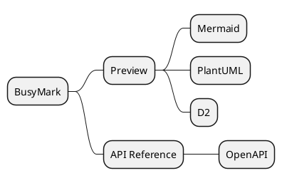

## Work breakdown structure

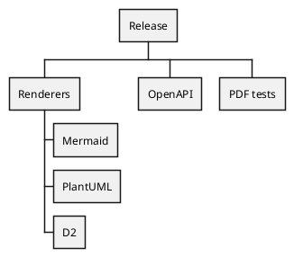

## Gantt

```plantuml
@startgantt
Project starts 2026-08-18
[Renderer contracts] lasts 2 days
[Preview integration] starts at [Renderer contracts]'s end and lasts 2 days
[PDF verification] starts at [Preview integration]'s end and lasts 1 day
@endgantt
```

## JSON

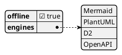

## YAML

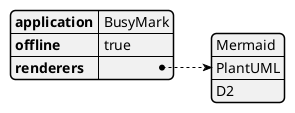
