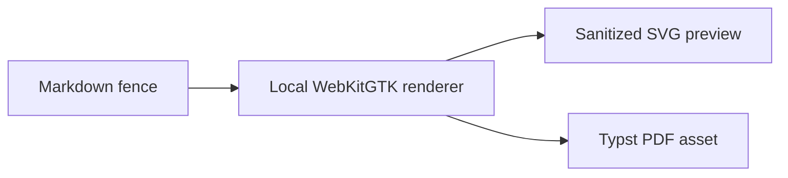
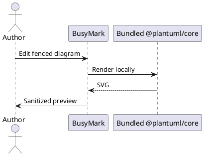

# BusyMark offline visualizations

This document exercises every renderer without a network connection.

## Mermaid



## PlantUML



## D2 vector output

```d2
direction: right
markdown: Markdown source
renderer: Bundled D2 CLI
preview: Sanitized SVG
pdf: Typst PDF
markdown -> renderer -> preview
renderer -> pdf
```

## D2 Markdown-label raster fallback

```d2
source: |md
  # BusyMark
  **Offline** diagram rendering
|
source -> output: browser-dependent label
```

## OpenAPI

```openapi
openapi: 3.1.0
info:
  title: BusyMark Demo API
  version: 1.0.0
  description: An offline API Reference demonstration.
servers:
  - url: https://api.example.test/v1
    description: Demonstration server (requests are disabled)
paths:
  /notes:
    get:
      operationId: listNotes
      summary: List Markdown notes
      tags: [Notes]
      responses:
        "200":
          description: Notes returned successfully
          content:
            application/json:
              schema:
                type: array
                items:
                  $ref: "#/components/schemas/Note"
    post:
      operationId: createNote
      summary: Create a Markdown note
      tags: [Notes]
      requestBody:
        required: true
        content:
          application/json:
            schema:
              $ref: "#/components/schemas/NoteInput"
      responses:
        "201":
          description: Note created
components:
  securitySchemes:
    demoToken:
      type: http
      scheme: bearer
  schemas:
    Note:
      type: object
      required: [id, title]
      properties:
        id:
          type: string
          format: uuid
        title:
          type: string
        body:
          type: string
    NoteInput:
      type: object
      required: [title]
      properties:
        title:
          type: string
        body:
          type: string
```
