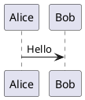

# Offline visualizations

BusyMark renders Mermaid, PlantUML, D2, and fenced OpenAPI content locally.
The original fenced source remains authoritative: editing and history views use
the source, and saving preserves the fence and language spelling.

## Supported fences

| Content | Fence identifiers | Reading and Editor views | PDF export |
| --- | --- | --- | --- |
| Mermaid | `mermaid` | Sanitized SVG or PNG | Vector SVG when safe; otherwise high-resolution PNG |
| PlantUML | `plantuml`, `puml` | Sanitized SVG or PNG | Vector SVG when safe; otherwise high-resolution PNG |
| D2 | `d2` | Sanitized SVG or PNG | Vector SVG when safe; otherwise high-resolution PNG |
| OpenAPI | `openapi`, `oas`, `swagger` | Summary with a BusyMark-owned reference window | Static, selectable API reference |

Fence identifiers are case-insensitive. A whole YAML or JSON file is not
automatically treated as OpenAPI; put the specification in a recognized fence.

## Diagram examples

````markdown




```d2
source -> preview
```
````

BusyMark renders common Mermaid diagram families and the PlantUML families
available in the packaged MIT browser engine. D2 imports and icon or image assets
inside a D2 fence are not supported. The bundled D2 executable is currently
available only for Linux amd64.

## OpenAPI

Use YAML or JSON inside an `openapi`, `oas`, or `swagger` fence:

````markdown
```openapi
openapi: 3.1.0
info:
  title: Example API
  version: 1.0.0
paths: {}
```
````

BusyMark accepts OpenAPI 3.2, 3.1, and 3.0 and Swagger 2.0. The interactive
reference receives bundled content rather than a URL and cannot issue API
requests. Relative specification references must remain inside the open
workspace. Remote references, absolute paths, traversal, symlink escapes,
oversized files, and excessive or circular dependency graphs are rejected.

PDF and HTML export use static API content instead of a screenshot of the
interactive reference. Schema objects are expanded within the reference; BusyMark
does not generate a separate website page for every schema.

## Writerside diagram forms

Writerside Markdown and XML topics can use semantic code blocks:

```xml
<code-block lang="mermaid">flowchart LR
  A --&gt; B</code-block>

<code-block lang="plantuml"><![CDATA[
@startuml
A -> B
@enduml
]]></code-block>

<code-block lang="d2">a -> b</code-block>
```

Writerside's referenced-source forms are supported for all three diagram
renderers. Paths are relative to the topic and must remain inside the open
Writerside project:

````markdown
<code-block lang="D2" src="../codeSnippets/graph.d2"/>

```mermaid
```
{ src="../codeSnippets/flow.mmd" }
````

Referenced files must be valid UTF-8 and stay within the configured size limit.
Absolute paths, URI schemes, traversal, and symlink escapes are rejected.
Semantic tags and `src` attributes are enabled only for Writerside projects;
ordinary Markdown treats them as ordinary markup.

## Export and failures

Generated diagrams and API references are included in PDF and offline HTML
exports. When a renderer fails, BusyMark keeps the original fenced source as a
readable fallback and reports a warning instead of aborting the document export.

Rendering does not require Java, Chromium, a public rendering service, or a
first-run download. D2 runs as a bounded local process. Mermaid, PlantUML, and
OpenAPI run in BusyMark's packaged, no-network WebKit environment. Generated SVG
is sanitized before display or export, and styling that cannot be preserved
safely as vector content is rasterized rather than silently removed.

Maintainers can find architecture, dependency, and verification details in
[Visualization implementation and verification](development/visualizations.md).

## Syntax references

- [Writerside D2 diagrams](https://www.jetbrains.com/help/writerside/d2-diagrams.html)
- [Writerside PlantUML diagrams](https://www.jetbrains.com/help/writerside/plantuml-diagrams.html)
- [Writerside Mermaid diagrams](https://www.jetbrains.com/help/writerside/mermaid-diagrams.html)
- [D2 imports](https://d2lang.com/tour/imports/)
- [D2 icons and images](https://d2lang.com/tour/icons/)
