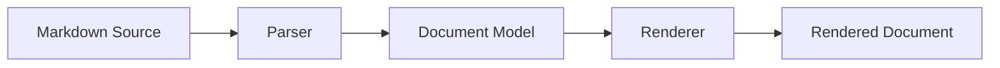
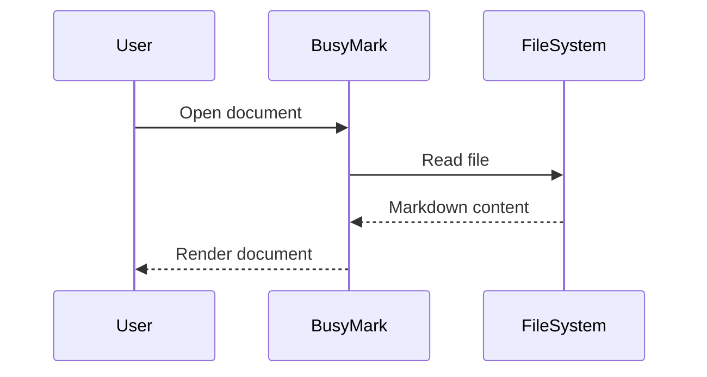
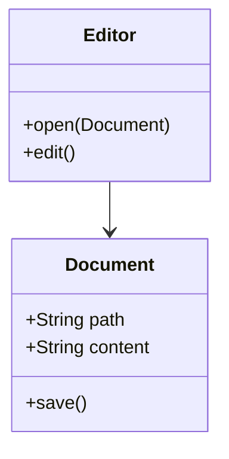
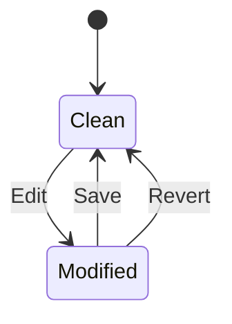
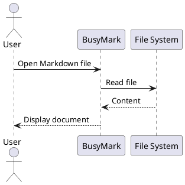
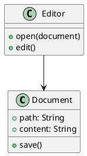
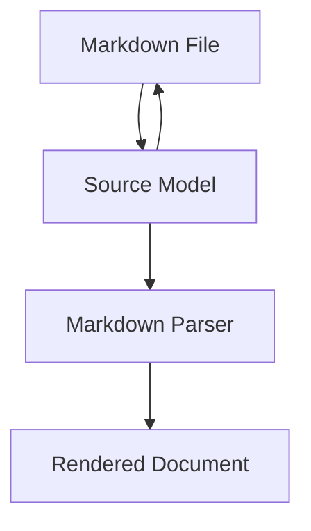

# BusyMark Markdown Demo

A comprehensive Markdown document demonstrating common Markdown syntax, GitHub-style extensions, mathematical notation, diagrams, and technical documentation blocks.

---

## Heading 2

### Heading 3

#### Heading 4

##### Heading 5

###### Heading 6

---

# 2. Paragraphs

This is a normal paragraph. Markdown paragraphs are separated by a blank line.

This is another paragraph containing a longer sentence to demonstrate normal text wrapping inside the editor and rendered document.

A line can end with two spaces
to create a hard line break.

---

# 3. Text Formatting

Normal text

*Italic text*

*Italic text*

**Bold text**

**Bold text**

***Bold and italic text***

***Bold and italic text***

~~Strikethrough text~~

`inline code`

Text with **bold**, *italic*, ~~strikethrough~~, and `inline code` together.

Escaped Markdown characters:

*not italic*

# not a heading

`not code`

---

# 4. Blockquotes

> This is a blockquote.

> A blockquote can contain multiple paragraphs.
>
> This is the second paragraph.

Nested blockquotes:

> Level one
>
> > Level two
> >
> > > Level three

Blockquotes can contain other Markdown:

> ## Quoted heading
>
> * First item
> * Second item
>
> **Important:** Markdown remains available inside the quote.

---

# 5. Unordered Lists

* First item
* Second item
* Third item

Alternative markers:

* Item using an asterisk
* Another item

- Item using a plus sign
- Another item

Nested lists:

* Operating systems

  * Linux

  * Ubuntu
    * Fedora
  * Windows
  * macOS
* Mobile platforms

  * Android
  * iOS

---

# 6. Ordered Lists

1. First step
2. Second step
3. Third step

Nested ordered lists:

1. Prepare

   1. Install dependencies
   2. Configure the project
2. Build

   1. Compile
   2. Run tests
3. Release

Markdown can automatically number items:

1. Alpha
2. Beta
3. Gamma

---

# 7. Task Lists

* [x] Create project
* [x] Implement editor
* [x] Implement source view
* [ ] Complete documentation
* [ ] Publish release

Nested tasks:

* [x] Rendering

  * [x] Markdown
  * [x] Tables
  * [x] Code blocks
  * [x] Diagrams
* [ ] Release

  * [x] Build
  * [ ] Publish

---

# 8. Links

Inline link:

[OpenAI](https://openai.com)

Link with title:

[Markdown](https://daringfireball.net/projects/markdown/ "Markdown")

Automatic URL:

[https://example.com](https://example.com)

Automatic email:

[developer@example.com](mailto:developer@example.com)

Reference-style links:

[BusyMark][busymark]

[Markdown specification][commonmark]

[busymark]: https://github.com/busystack/busymark
[commonmark]: https://spec.commonmark.org/

---

# 9. Images

Standard image:


Image with title:


Linked image:

[](https://example.com)

---

# 10. Horizontal Rules

Three hyphens:

---

Three asterisks:

---

Three underscores:

---

---

# 11. Inline Code

Use `git status` to inspect the working tree.

A Java variable can be written as `List<String> names`.

Use backticks inside inline code by using a longer delimiter:

`` `example` ``

---

# 12. Fenced Code Blocks

Plain text:

```text
BusyMark
Markdown editor
Linux desktop
```

Java:

```java
public final class Greeting {

    public static void main(String[] args) {
        String message = "Hello, Markdown!";
        System.out.println(message);
    }
}
```

Dart:

```dart
void main() {
  final values = <int>[1, 2, 3, 4];

  for (final value in values) {
    print(value);
  }
}
```

JavaScript:

```javascript
const users = [
  { id: 1, name: "Ada" },
  { id: 2, name: "Grace" }
];

const names = users.map(user => user.name);
console.log(names);
```

Python:

```python
def fibonacci(n):
    a, b = 0, 1

    for _ in range(n):
        yield a
        a, b = b, a + b
```

JSON:

```json
{
  "application": "BusyMark",
  "platform": "Linux",
  "features": [
    "Markdown",
    "Git",
    "Diagrams"
  ]
}
```

YAML:

```yaml
application:
  name: BusyMark
  platform: Linux
  features:
    - Markdown
    - Git
    - Diagrams
```

Bash:

```bash
git status
git add .
git commit -m "Update documentation"
```

SQL:

```sql
SELECT
    id,
    name,
    created_at
FROM document
WHERE archived = false
ORDER BY created_at DESC;
```

XML:

```xml
<application>
    <name>BusyMark</name>
    <platform>Linux</platform>
</application>
```

HTML:

```html
<section>
    <h1>Documentation</h1>
    <p>Technical documentation written in Markdown.</p>
</section>
```

CSS:

```css
.document {
    max-width: 960px;
    margin: 0 auto;
    line-height: 1.6;
}
```

---

# 13. Indented Code

```
This is an indented code block.
Markdown formatting is not interpreted here.
```

---

# 14. Tables

Basic table:

| Name   | Type | Status   |
| ------ | ---- | -------- |
| Editor | View | Complete |
| Source | View | Complete |
| Split  | View | Complete |
| Read   | View | Complete |

Alignment:

| Left    | Center | Right |
| :------ | :----: | ----: |
| Alpha   |  Beta  |   100 |
| Gamma   |  Delta |   200 |
| Epsilon |  Zeta  |   300 |

Formatting inside tables:

| Feature                     | Description          |
| --------------------------- | -------------------- |
| **Bold**                    | Important content    |
| *Italic*                    | Emphasized content   |
| `code`                      | Technical identifier |
| [Link](https://example.com) | External resource    |

---

# 15. Footnotes

Markdown can contain footnotes.[^markdown]

A second footnote can contain more detailed information.[^details]

[^markdown]: Markdown is a lightweight markup language.

[^details]: Footnotes are useful when supplementary information should remain outside the main flow of the document.

---

# 16. Definition-Style Content

Term
: A word or expression being defined.

Markdown
: A lightweight markup language used for structured plain-text documents.

BusyMark
: A desktop Markdown editor.

---

# 17. HTML

<div>
  <strong>Raw HTML block</strong>
  <p>This section uses HTML directly inside Markdown.</p>
</div>

Inline HTML can also be used, such as <kbd>Ctrl</kbd> + <kbd>S</kbd>.

Details element:

<details>
<summary>Expand details</summary>

This content is initially collapsed when the renderer supports the HTML element.

</details>

---

# 18. Special Characters and Entities

Copyright: ©

Registered trademark: ®

Trademark: ™

Less than: <

Greater than: >

Ampersand: &

Non-breaking space: `A&nbsp;B`

Unicode also works directly:

✓ ★ → ← ↔ ∞ λ π Ω

---

# 19. Mathematical Expressions

Inline mathematics:

The quadratic equation is $ax^2 + bx + c = 0$.

Einstein's mass-energy relation is $E = mc^2$.

A matrix can be written inline as $A \in \mathbb{R}^{m \times n}$.

Display mathematics:

$$
x = \frac{-b \pm \sqrt{b^2 - 4ac}}{2a}
$$

Summation:

$$
\sum_{i=1}^{n} i = \frac{n(n+1)}{2}
$$

Integral:

$$
\int_{-\infty}^{\infty} e^{-x^2}\,dx = \sqrt{\pi}
$$

Matrix:

$$
A =
\begin{bmatrix}
1 & 2 & 3 \\
4 & 5 & 6 \\
7 & 8 & 9
\end{bmatrix}
$$

Piecewise function:

$$
f(x) =
\begin{cases}
x^2, & x \ge 0 \\
-x, & x < 0
\end{cases}
$$

---

# 20. Mermaid

Flowchart:



Sequence diagram:



Class diagram:



State diagram:



---

# 21. PlantUML



Class diagram:



---

# 22. D2

```d2
user: User
editor: BusyMark
filesystem: File System

user -> editor: Open document
editor -> filesystem: Read Markdown
filesystem -> editor: Content
editor -> user: Render document
```

Architecture example:

```d2
BusyMark: {
  Editor
  Source
  Split
  Read

  Editor -> Source
  Editor -> Split
  Editor -> Read
}

Filesystem -> BusyMark.Editor: Markdown files
```

---

# 23. OpenAPI

```yaml openapi
openapi: 3.1.0

info:
  title: Document API
  version: 1.0.0
  description: Example API definition embedded in a Markdown document.

servers:
  - url: https://api.example.com

paths:
  /documents:
    get:
      summary: List documents
      operationId: listDocuments
      responses:
        "200":
          description: Documents returned successfully
          content:
            application/json:
              schema:
                type: array
                items:
                  $ref: "#/components/schemas/Document"

    post:
      summary: Create document
      operationId: createDocument
      requestBody:
        required: true
        content:
          application/json:
            schema:
              $ref: "#/components/schemas/CreateDocument"
      responses:
        "201":
          description: Document created
          content:
            application/json:
              schema:
                $ref: "#/components/schemas/Document"

  /documents/{id}:
    get:
      summary: Get document
      parameters:
        - name: id
          in: path
          required: true
          schema:
            type: string
      responses:
        "200":
          description: Document returned
          content:
            application/json:
              schema:
                $ref: "#/components/schemas/Document"

        "404":
          description: Document not found

components:
  schemas:
    Document:
      type: object
      required:
        - id
        - title
        - content
      properties:
        id:
          type: string
        title:
          type: string
        content:
          type: string

    CreateDocument:
      type: object
      required:
        - title
        - content
      properties:
        title:
          type: string
        content:
          type: string
```

---

# 24. Nested Markdown

> ## Documentation note
>
> This blockquote demonstrates several constructs together.
>
> 1. **Markdown** provides document structure.
> 2. `BusyMark` displays and edits the source.
> 3. Technical documents can contain:
>
>    * Tables
>    * Source code
>    * Mathematics
>    * Diagrams
>
> ```java
> record Document(String title, String content) {}
> ```

---

# 25. Long Content

Lorem ipsum dolor sit amet, consectetur adipiscing elit. Integer posuere erat a ante venenatis dapibus posuere velit aliquet. Donec sed odio dui. Maecenas faucibus mollis interdum. Vestibulum id ligula porta felis euismod semper.

This paragraph exists to demonstrate normal wrapping, scrolling, selection, search, rendering, and editing behavior with longer prose. A professional Markdown editor should preserve the underlying source while presenting readable typography in rendered views.

Another paragraph follows to make document boundaries and paragraph spacing visible. Markdown remains plain text, which makes documents suitable for source control, review, diffing, automation, and long-term archival.

---

# 26. Mixed Technical Documentation

## System Architecture

The application processes Markdown documents through several stages:

1. Load the source file.
2. Parse Markdown syntax.
3. Construct the document representation.
4. Render supported elements.
5. Allow the user to edit the source.
6. Persist modifications.

### Components

| Component       | Responsibility                         |
| --------------- | -------------------------------------- |
| Editor          | Document editing                       |
| Source          | Raw Markdown editing                   |
| Split           | Simultaneous source and rendered views |
| Read            | Rendered document reading              |
| Renderer        | Markdown and extension rendering       |
| Git integration | Version-control operations             |

### Processing Flow



### Complexity Example

For a sequence of $n$ elements, a linear traversal requires:

$$
T(n) = O(n)
$$

A binary search over sorted data requires:

$$
T(n) = O(\log n)
$$

### Example Implementation

```java
public static int binarySearch(int[] values, int target) {
    int low = 0;
    int high = values.length - 1;

    while (low <= high) {
        int middle = low + (high - low) / 2;

        if (values[middle] == target) {
            return middle;
        }

        if (values[middle] < target) {
            low = middle + 1;
        } else {
            high = middle - 1;
        }
    }

    return -1;
}
```

---

# 27. Edge Cases

Empty emphasis markers should remain understandable in source form.

Characters commonly occurring in technical documentation:

`* _ # > < > [ ] ( ) { } \ | ~ `

URLs with query parameters:

[https://example.com/search?q=markdown&sort=desc](https://example.com/search?q=markdown&sort=desc)

Paths:

`/home/user/Documents/example.md`

Windows-style path:

`C:\Users\Example\Documents\example.md`

Generic types:

`Map<String, List<Integer>>`

Command options:

`git log --oneline --all --decorate`

Shell variables:

`${HOME}`

Regular expression:

`^[a-zA-Z0-9_-]+$`

---

# 28. Document Conclusion

This document exercises the principal content types expected in technical Markdown documents:

* Text formatting
* Headings
* Lists
* Tasks
* Links
* Images
* Quotes
* Tables
* Code
* HTML
* Footnotes
* Mathematics
* Mermaid
* PlantUML
* D2
* OpenAPI
* Nested structures
* Long-form technical documentation

**End of document.**

If this is specifically for BusyMark regression/demo testing, I can also make a stricter version designed to exercise every parser/rendering edge case rather than serve as a readable showcase.
